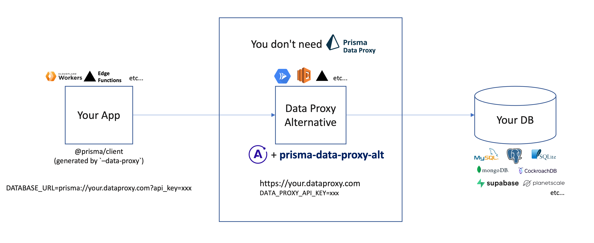
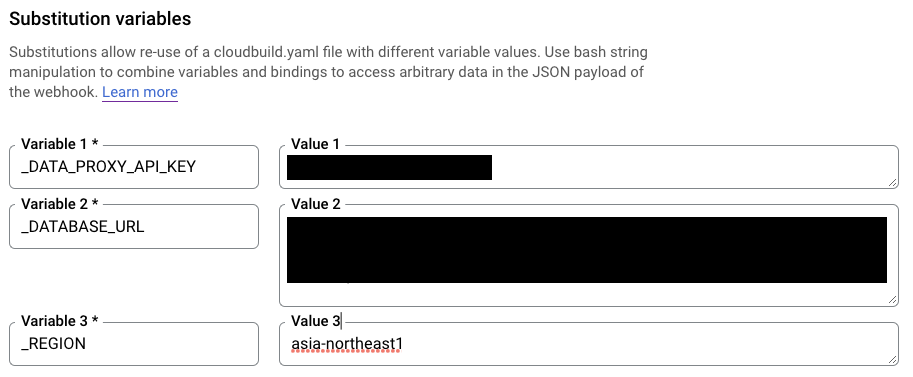

[](https://badge.fury.io/js/prisma-data-proxy-alt)

# Alternative Prisma Data Proxy

This is a library to alternate and self-host the [Prisma Data Proxy (cloud.prisma.io)](https://www.prisma.io/docs/concepts/data-platform/data-proxy).

In order to deploy your project to edge runtimes (such as Cloudflare Workers or Vercel Edge Functions) and use Prisma, you will need to use the Prisma Data Proxy.  
However, it is currently only available in a limited number of regions and the choice of data sources is limited. There is also the stress of latency caused by cold standby.

Therefore, I have created a server library that replaces the Prisma Data Proxy. Using it, you are free from those stressful limitations.  
You can deploy it on any platform in any region you like and use any data source you like, such as Supabase.

No changes are required to your prisma client code, just set the `DATABASE_URL` to the URL you self-hosted with this library.

## Overview



## Setup

### Setup proxy server

First, an Apollo server is built as a substitute for the data proxy.  

```bash
yarn add prisma-data-proxy-alt express apollo-server-express
```

The server script is as follows.  

```ts
// index.ts
import { PrismaClient, Prisma } from "@prisma/client";
import express from "express";
import { ApolloServer } from "apollo-server-express";
import { beforeMiddleware, afterMiddleware, makeServerConfig } from "prisma-data-proxy-alt";

const db = new PrismaClient();

const port = process.env.PORT || "3000";
const apiKey = process.env.DATA_PROXY_API_KEY || "foo";

(async () => {
  const app = express();
  const server = new ApolloServer(makeServerConfig(Prisma, db));

  await Promise.all([db.$connect(), server.start()]);
  app.use(beforeMiddleware({ apiKey }));
  app.use(afterMiddleware());
  server.applyMiddleware({ app, path: "/*" });
  app.listen({ port }, () =>
    console.log(
      `🚀 Server ready at http://localhost:${port}${server.graphqlPath}`
    )
  );
})();
```

### Setup Prisma

Include prisma schema in your project. **The same schema as the client**.  

```bash
cp your_client_project_path/prisma/schema.prisma ./prisma/schema.prisma
```

Install `prisma` and `@prisma/client`.
```bash
yarn add -D prisma
yarn add @prisma/client
```

## Deploy 

### GCP Cloud Run

Create `Dockerfile`

```dockerfile
FROM node:16.15-bullseye-slim as base

RUN apt-get update && apt-get install -y tini ca-certificates \
  && apt-get clean \
  && rm -rf /var/lib/apt/lists/*

WORKDIR /app

FROM base as builder

COPY package.json .
COPY yarn.lock .
COPY prisma/schema.prisma ./prisma/schema.prisma
COPY index.ts .

RUN yarn install

RUN yarn prisma generate
RUN yarn tsc index.ts --esModuleInterop

FROM base

ENV PORT=8080

COPY --from=builder /app/node_modules ./node_modules
COPY --from=builder /app/index.js .

USER node

ENTRYPOINT ["/usr/bin/tini", "--"]
CMD ["node", "index.js"]
```

Create `cloudbuild.yml`

```yml
steps:
  - name: 'gcr.io/kaniko-project/executor:latest'
    args:
      - --destination=gcr.io/$PROJECT_ID/prisma-data-proxy-alt:$SHORT_SHA
      - --destination=gcr.io/$PROJECT_ID/prisma-data-proxy-alt:latest
      - --cache=true
  - name: 'gcr.io/google.com/cloudsdktool/cloud-sdk'
    entrypoint: gcloud
    args:
      - run
      - deploy
      - prisma-data-proxy-alt
      - --image
      - gcr.io/$PROJECT_ID/prisma-data-proxy-alt:latest
      - --region
      - $_REGION
      - --allow-unauthenticated
      - --set-env-vars
      - DATABASE_URL=$_DATABASE_URL
      - --set-env-vars
      - DATA_PROXY_API_KEY=$_DATA_PROXY_API_KEY
substitutions:
  _REGION: asia-northeast1
  _DATABASE_URL: your_database_url
  _DATA_PROXY_API_KEY: your_api_key
```

Create a new trigger from the GCP Cloud Build web console and link it to your repository.  

Set `_REGION`, `_DATABASE_URL`, and `_DATA_PROXY_API_KEY` in the substitution values.



- `_REGION`: The region of deploy target for Cloud Run
- `_DATABASE_URL`: Connection URL to your data source (mysql, postgres, etc...)
- `_DATA_PROXY_API_KEY`: Arbitrary string to be used when connecting data proxy. e.g. `prisma://your.deployed.domain?api_key={DATA_PROXY_API_KEY}`  
  (do not divulge it to outside parties)

## For Client (on your application)

On the client side, generate the Prisma client in data proxy mode `--data-proxy`. [official document](https://www.prisma.io/docs/concepts/data-platform/data-proxy#step-4-generate-the-client)
```bash
yarn prisma generate --data-proxy
```

Set the `DATABSE_URL` from the domain of the server you deployed and the api key (`DATA_PROXY_API_KEY`) you set for it.
```
DATABSE_URL=prisma://${YOUR_DEPLOYED_PROJECT_DOMAIN}?api_key=${DATA_PROXY_API_KEY}
```

**Now you can connect to the (alternative) Data Proxy from your application. 🎉**

## Contribution

Please read [CONTRIBUTING.md](./CONTRIBUTING.md) for details on our code of conduct, and the process for submitting pull requests to us.

## LICENCE

This project is licensed under the MIT License - see the [LICENSE](./LICENSE) file for details
